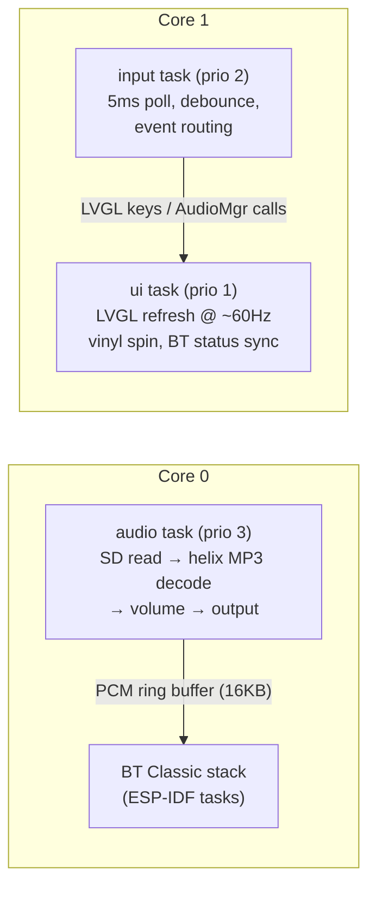

# Pseudo Vinyl MP3 Player

A portable, battery-powered MP3 player built on the **ESP32-WROOM-32** that streams audio wirelessly to Bluetooth earbuds and features a **vinyl-style spinning album art** animation on a circular display.


> [!NOTE]
> **Why the classic ESP32 and not the S3?** The project originally targeted the ESP32-S3, but the S3 only has BLE — **no Bluetooth Classic**, which A2DP audio streaming requires. The original ESP32 is the only chip in the family that can act as an A2DP source. The trade-off is that the WROOM-32 has no PSRAM, which shapes several architecture decisions below.

## Features

- **Bluetooth Audio** — Streams to wireless earbuds/speakers via A2DP (primary output), with on-device scanning, pairing, and auto-reconnect
- **Wired Output** — Secondary 3.5mm headphone jack via PCM5102 I2S DAC, switchable in Settings
- **Circular Display** — 1.28" GC9A01 240×240 IPS round screen
- **Vinyl Spin Animation** — Album art spins like a vinyl record during playback, with a progress ring around the display edge
- **Physical Controls** — 3 buttons (play/pause, next, previous) + rotary encoder (volume/scroll)
- **Shuffle & Repeat** — Normal / Shuffle / Repeat All / Repeat One, cycled via encoder push
- **SD Card Storage** — Recursively scans a FAT32 SD card for MP3s
- **Persistent Settings** — Output mode, volume, and paired Bluetooth device survive power cycles (NVS)
- **Battery Powered** — LiPo battery with TP4056 USB-C charging

## Documentation

| Document | Contents |
|---|---|
| [User Guide](docs/USER_GUIDE.md) | Getting started, controls, pairing, troubleshooting |
| [PRD](docs/PRD.md) | Full requirements, pin assignments, risks |
| This README | System architecture, build instructions |

---

## Hardware

| Component | Model | Interface |
|---|---|---|
| MCU | ESP32-WROOM-32 (4MB flash, no PSRAM) | — |
| DAC | PCM5102 | I2S |
| Display | GC9A01 1.28" Round IPS, 240×240 | SPI (VSPI) |
| Storage | SPI SD card reader, FAT32 | SPI (HSPI) |
| Encoder | KY-040 rotary encoder | GPIO |
| Buttons | 3× tactile switches | GPIO |
| Battery | 3.7V LiPo + TP4056 USB-C charger | — |

### Wiring

Full pin table with rationale lives in the [PRD §5](docs/PRD.md) and [`firmware/src/config.h`](firmware/src/config.h). Summary:

| Peripheral | Pins |
|---|---|
| Display (VSPI) | SCK 18, MOSI 23, CS 5, DC 2, RST 4, BL 19 |
| SD card (HSPI) | SCK 14, MOSI 13, MISO 35, CS 15 |
| PCM5102 (I2S) | BCK 26, LRCK 25, DIN 22 |
| Encoder | CLK 32, DT 33, SW 27 |
| Buttons | Play 16, Next 17, Prev 21 |
| Battery sense | GPIO 34 (ADC1) |

Three wiring rules worth knowing (all enforced by this pin map):

1. **GPIO 12 is deliberately unused.** Many SD modules have pull-ups on every line; a pull-up on GPIO 12 at boot selects 1.8V flash voltage and the board won't boot.
2. **Battery sense must be on ADC1** (GPIO 32–39). ADC2 is unusable while Bluetooth is running.
3. **Display and SD are on separate hardware SPI buses** (VSPI/HSPI), so display refresh never blocks audio streaming from the card.

---

## System Architecture

### Module layout

```
firmware/src/
├── main.cpp                  # Boot sequence + FreeRTOS tasks + input routing
├── config.h                  # All pins, buffer sizes, tunables
├── audio/audio_manager.*     # MP3 decode (helix), playlist, output routing
├── bluetooth/bt_manager.*    # A2DP source, discovery, PCM ring buffer, NVS
├── display/display_manager.* # TFT_eSPI + LVGL glue, draw buffers
├── display/ui_manager.*      # All LVGL screens, virtual keypad, album art
├── input/input_manager.*     # Debounced buttons + quadrature encoder ISR
└── storage/sd_manager.*      # SD mount, recursive MP3 scan, .art loading
```

Each module is a namespace with a small public API (`AudioMgr::`, `BtMgr::`, `UI::`, …); `main.cpp` is the only place that wires them together.

### Task model (dual-core FreeRTOS)



- **Audio task (core 0)** runs the decode loop: one `StreamCopy` step per iteration reads MP3 bytes from SD, decodes via helix, applies volume, and writes PCM to the active output. It shares core 0 with the Bluetooth stack on purpose — the 16KB ring buffer between them absorbs scheduling jitter.
- **UI task (core 1)** drives LVGL: syncs now-playing state, spins the vinyl, and polls Bluetooth state a few times per second (not every frame).
- **Input task (core 1)** polls buttons/encoder every 5ms with 50ms debounce and routes events based on the active screen.

### Audio pipeline

```
                         ┌──────────────── audio task ────────────────┐
SD card ──> MP3 file ──> StreamCopy ──> helix MP3 decoder ──> meter ──> VolumeStream ──┐
                                                                                       │ (runtime switch)
                             ┌─────────────────────────────────────────────────────────┤
                             ▼                                                         ▼
                      I2SStream (wired)                                      BtPrint → ring buffer
                             │                                                         │ (pulled by BT task)
                             ▼                                                         ▼
                      PCM5102 DAC → 3.5mm                                    A2DP source → earbuds
```

Key decisions:

- **helix MP3 (arduino-audio-tools)** instead of ESP32-audioI2S: the latter requires PSRAM as of v3.x, which the WROOM-32 doesn't have. Helix decodes in ~30KB of SRAM.
- **Output switching** re-routes the tail of the pipeline at runtime (Settings → Output). Wired mode stops the A2DP source entirely; Bluetooth mode stops the I2S driver.
- **Position/duration** are derived, not parsed: position = decoded PCM bytes ÷ byte rate; duration = position × file size ÷ compressed bytes consumed (exact for CBR, converges fast for VBR).
- **In BT mode with no sink connected, playback holds** rather than racing through the file while writes are dropped.
- A2DP is fixed at 44.1kHz — MP3s at other sample rates play off-speed over Bluetooth (fine on wired).

### Bluetooth design

`BtMgr` wraps `BluetoothA2DPSource` (pschatzmann/ESP32-A2DP):

- While unconnected, the library continuously discovers nearby A2DP sinks; every device seen is collected for the UI list.
- Selecting a device sets it as the **target** — the next discovery hit on that name connects, and the name is persisted to NVS so the player auto-reconnects on later boots.
- The BT stack pulls PCM from the ring buffer on its own task; underruns are zero-filled so the stream never stalls.

### Display & UI

- **TFT_eSPI** drives the GC9A01 at 40MHz on VSPI; **LVGL 8** renders into two 240×30 draw buffers (~14.4KB each) in internal DMA-capable RAM.
- `LV_COLOR_16_SWAP=1` produces SPI byte order directly, so the flush callback pushes pixels without a per-frame swap.
- **Navigation without a touchscreen:** a virtual LVGL *keypad* input device. The input task translates encoder turns into `LV_KEY_NEXT/PREV` (focus movement) and the Play button into `LV_KEY_ENTER` (select) whenever a menu screen is active. Each screen has its own LVGL focus group.
- **Album art** is a pre-scaled raw RGB565 file (`.art`) loaded once per track change, displayed inside a circle-clipped, rotating holder. See the art tool below.

### Memory budget (the no-PSRAM constraint)

Everything must fit in ~320KB of usable internal SRAM:

| Consumer | ~Size |
|---|---|
| BT Classic stack (controller + Bluedroid) | ~150KB |
| LVGL draw buffers (2 × 240×30 px) | 29KB |
| Album art (≤120×120 RGB565, capped) | ≤29KB |
| helix MP3 decoder | ~30KB |
| BT PCM ring buffer | 16KB |
| LVGL widgets, task stacks, everything else | remainder |

This is why art is capped at 120×120 (`ART_MAX_SIDE`) — a full 240×240 frame would be 113KB and simply doesn't fit next to the BT stack. Measured at build: **18.4% static RAM, 52.8% flash**.

---

## Building the Firmware

Requires [PlatformIO](https://platformio.org/).

```bash
cd firmware
pio run                 # build
pio run -t upload       # flash over USB
pio device monitor      # serial log @ 115200
```

The environment is `esp32dev` (see [`firmware/platformio.ini`](firmware/platformio.ini)). Libraries: TFT_eSPI, LVGL 8.3, arduino-audio-tools, arduino-libhelix, ESP32-A2DP. The 3MB `huge_app` partition is used (no OTA) because BT Classic + LVGL + codecs don't fit the default scheme.

### Debug environment (no hardware needed)

`esp32dev-debug` extends `esp32dev` with `DEBUG_MODE=1` — the serial console simulates buttons/encoder input, so you can exercise the UI without wiring up physical controls.

```bash
cd firmware
pio run -e esp32dev-debug              # build only
pio run -e esp32dev-debug -t upload    # build + flash over USB
pio device monitor                     # serial log @ 115200 (simulated input + [SD]/[BT]/[Audio]/[UI] logs)
```

## Album Art Pre-Scaler Tool

MP3 album art is prepared on your PC before copying music to the SD card — the device never decodes JPEG/PNG.

```bash
cd tools/prescale_art
pip install -r requirements.txt
python prescale_art.py /path/to/music
```

For each `song.mp3` with embedded art, this writes `song.art` alongside it: a raw 120×120 RGB565 bitmap (28,800 bytes, big-endian to match the firmware's `LV_COLOR_16_SWAP`). A GUI version (`prescale_art_gui.py`) is also available. Files larger than 120×120 are rejected by the firmware.

## Project Structure

```
Pseudo-Vinyl-MP3-Player/
├── README.md                # This file — architecture + build guide
├── docs/
│   ├── PRD.md               # Product Requirements Document
│   └── USER_GUIDE.md        # End-user guide (controls, pairing, troubleshooting)
├── firmware/                # PlatformIO project (ESP32-WROOM-32)
│   ├── platformio.ini
│   └── src/                 # Modules described above
├── tools/
│   └── prescale_art/        # Album art pre-scaler (CLI + GUI)
└── MP3PlayerPCB/            # KiCad PCB design (Phase 3)
```

## License

TBD
