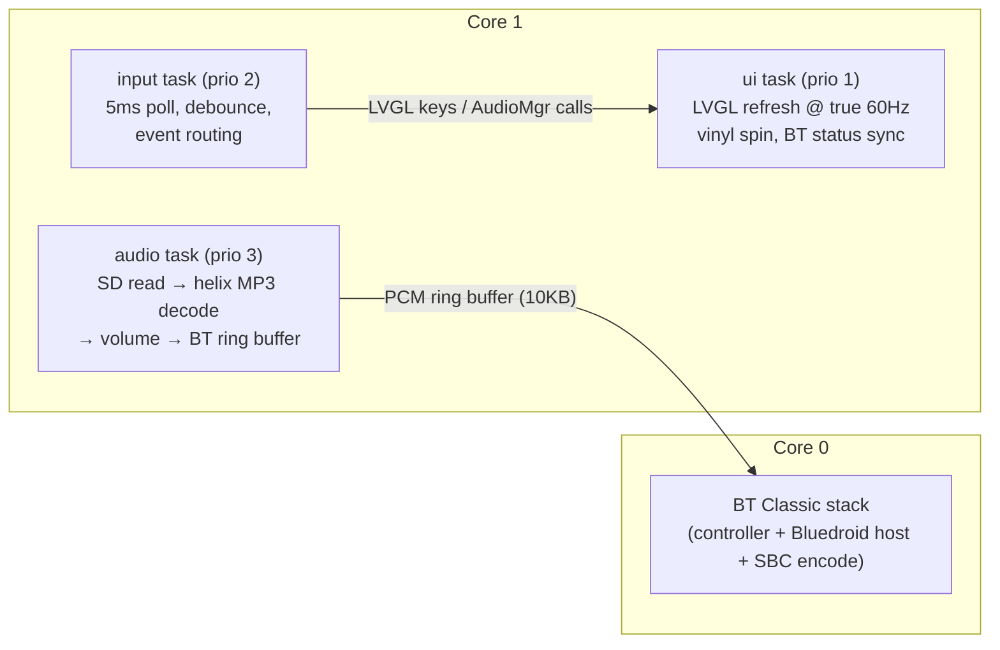

# Pseudo Vinyl MP3 Player

A portable, battery-powered MP3 player built on the **ESP32-WROVER N4R8** that streams audio wirelessly to Bluetooth earbuds and features a **vinyl-style spinning album art** animation on a circular display.


> [!NOTE]
> **Why the classic ESP32 and not the S3?** The project originally targeted the ESP32-S3, but the S3 only has BLE — **no Bluetooth Classic**, which A2DP audio streaming requires. The original ESP32 is the only chip in the family that can act as an A2DP source. The board started on a **WROOM-32** (no PSRAM, a hard ~250–290KB working-heap budget — see [`docs/MEMORY.md`](docs/MEMORY.md) for everything that constraint drove) and later moved to a **WROVER N4R8**, same classic-ESP32 die plus **8MB PSRAM**, which is now the current hardware target. Audio output is **Bluetooth-only** — the wired PCM5102 DAC path from early prototyping was removed once the BT stack needed the RAM it occupied, and hasn't come back now that PSRAM is available (out of scope, not a technical blocker).

## Features

- **Bluetooth Audio** — Streams to wireless earbuds/speakers via A2DP, with on-device scanning, pairing, and auto-reconnect. Bluetooth is the only output — there is no wired jack.
- **Circular Display** — 1.28" GC9A01 240×240 IPS round screen
- **Vinyl Spin Animation** — Album art spins like a vinyl record during playback at a true 60fps, with a progress ring around the display edge and a drop-shadowed title for legibility over any art color
- **Physical Controls** — 3 buttons (play/pause, next, previous) + rotary encoder (volume/scroll)
- **Shuffle & Repeat** — Normal / Shuffle / Repeat All / Repeat One, cycled via encoder push
- **SD Card Storage** — Recursively scans a FAT32 SD card for MP3s; the library and playlist list load automatically at boot, before any speaker connects
- **Folder Playlists** — Top-level SD card folders are selectable playlists, alongside an always-available "All Songs" library
- **Persistent Settings** — Volume and paired Bluetooth device survive power cycles (NVS)
- **Battery Powered** — LiPo battery with TP4056 USB-C charging

## Documentation

| Document | Contents |
|---|---|
| [User Guide](docs/USER_GUIDE.md) | Getting started, controls, pairing, troubleshooting |
| [PRD](docs/PRD.md) | Original requirements/pins/risks — WROOM-32 prototype era, not updated for the WROVER pin move |
| [MEMORY.md](docs/MEMORY.md) | Canonical hardware bring-up log — every RAM/BT/audio failure found on real hardware, root cause, and fix |
| [HANDOFF.md](docs/HANDOFF.md) | What's implemented-but-not-yet-hardware-verified right now |
| This README | System architecture, build instructions |

---

## Hardware

| Component | Model | Interface |
|---|---|---|
| MCU | ESP32-WROVER N4R8 (4MB flash, 8MB PSRAM) | — |
| Display | GC9A01 1.28" Round IPS, 240×240 | SPI (GPIO-matrix routed) |
| Storage | SPI SD card reader, FAT32 | SPI (HSPI) |
| Encoder | KY-040 rotary encoder | GPIO |
| Buttons | 3× tactile switches | GPIO |
| Battery | 3.7V LiPo + TP4056 USB-C charger | — |

### Wiring

**[`firmware/src/config.h`](firmware/src/config.h) is the source of truth for pins** — it's updated in lockstep with the firmware. [PRD §5](docs/PRD.md) still documents the original WROOM-32 prototype wiring and has not been updated for the WROVER pin move below; treat it as historical background, not a wiring reference.

| Peripheral | Pins |
|---|---|
| Display | MOSI 0, SCLK 5, CS 2, DC 23, RST 15 |
| SD card (HSPI) | SCLK 21, MOSI 18, MISO 22, CS 19 |
| Encoder | CLK 32, DT 33, SW 27 |
| Buttons | Play 13, Next 14, Prev 4 |
| Battery sense | GPIO 34 (ADC1) |

Wiring rules worth knowing (all enforced by this pin map):

1. **GPIO 16/17 are reserved for PSRAM** (CS/CLK) on the WROVER and can't be used for anything else — this is why display/SD moved off their original WROOM-32 pins.
2. **GPIO 0 is the boot-mode strapping pin**, now carrying display MOSI. It must read HIGH at reset or the board drops into serial download instead of booting; safe as an SPI output once running, but the first suspect if boots become unreliable (add a 10k pull-up to 3V3, or move MOSI to GPIO 25/26).
3. **GPIO 12 is deliberately unused.** Many SD modules have pull-ups on every line; a pull-up on GPIO 12 at boot selects 1.8V flash voltage and the board won't boot.
4. **Battery sense must be on ADC1** (GPIO 32–39). ADC2 is unusable while Bluetooth is running.
5. **Display and SD are on separate hardware SPI buses**, so display refresh never blocks audio streaming from the card. Both are now GPIO-matrix routed (no IOMUX-native pins were free after the PSRAM/strapping constraints above) — if the panel tears or shows garbage, drop `SPI_FREQUENCY` from 40MHz to 27MHz before suspecting anything else.

---

## System Architecture

### Module layout

```
firmware/src/
├── main.cpp                  # Boot sequence + FreeRTOS tasks + input routing
├── config.h                  # All pins, buffer sizes, tunables
├── audio/audio_manager.*     # MP3 decode (helix), playlist, output routing
├── bluetooth/bt_manager.*    # A2DP source, discovery, PCM ring buffer, NVS
├── display/display_manager.* # TFT_eSPI + LVGL glue, draw buffers
├── display/ui_manager.*      # All LVGL screens, virtual keypad, album art
├── input/input_manager.*     # Debounced buttons + quadrature encoder ISR
└── storage/sd_manager.*      # SD mount, recursive MP3 scan, playlist folders, .art loading
```

Each module is a namespace with a small public API (`AudioMgr::`, `BtMgr::`, `UI::`, …); `main.cpp` is the only place that wires them together.

### Task model (dual-core FreeRTOS)


```mermaid
graph LR
    subgraph Core 0
        BT["BT Classic stack<br/>(controller + Bluedroid host + SBC encode)"]
    end
    subgraph Core 1
        AUDIO["audio task (prio 3)<br/>SD read → helix MP3 decode<br/>→ volume → BT ring buffer"]
        INPUT["input task (prio 2)<br/>5ms poll, debounce,<br/>event routing"]
        UI["ui task (prio 1)<br/>LVGL refresh @ true 60Hz<br/>vinyl spin, BT status sync"]
    end
    AUDIO -- "PCM ring buffer (10KB)" --> BT
    INPUT -- "LVGL keys / AudioMgr calls" --> UI
```

Core 0 is Bluetooth-only by design: SD/decode flash-cache pressure sharing a core with the BT stack was a measured source of L2CAP congestion (audio stutter), so all three of this project's own tasks — audio, input, UI — run on core 1, with audio at the highest priority of the three (dropped frames beat dropped audio).

- **Audio task (core 1, prio 3)** runs the decode loop: one `StreamCopy` step per iteration reads MP3 bytes from SD, decodes via helix, applies volume, and writes PCM into the ring buffer that feeds Bluetooth. Decode preempts LVGL rendering, which shares the core at a lower priority.
- **UI task (core 1, prio 1)** drives LVGL: syncs now-playing state, spins the vinyl, and polls Bluetooth state a few times per second (not every frame).
- **Input task (core 1, prio 2)** polls buttons/encoder every 5ms with 50ms debounce and routes events based on the active screen.

### Audio pipeline

```
              ┌────────────────────────── audio task (core 1) ──────────────────────────┐
SD card ──> MP3 file ──> StreamCopy ──> helix MP3 decoder ──> meter ──> VolumeStream ──> BtPrint
                                                                                             │
                                                                                             ▼
                                                                        PCM ring buffer (10KB, BtMgr)
                                                                                             │ (pulled by BT task, core 0)
                                                                                             ▼
                                                                              A2DP source → earbuds
```

Key decisions:

- **helix MP3 (arduino-audio-tools)** instead of ESP32-audioI2S: the latter requires PSRAM as of v3.x, which the original WROOM-32 target didn't have. Helix decodes in ~25KB and is now allocated once at boot and kept resident for the app's lifetime (re-allocating it at play time raced other allocations and lost, on hardware — see `docs/MEMORY.md`).
- **Bluetooth is the only output.** A wired PCM5102 I2S path existed during early prototyping and was removed once it couldn't fit next to the BT stack on the no-PSRAM board; it hasn't been reinstated now that the WROVER has PSRAM to spare (possible follow-up, not implemented).
- **Position/duration are derived, not parsed from ID3/Xing headers.** Position = decoded PCM bytes ÷ byte rate. Duration is an estimate — position × file size ÷ compressed bytes consumed so far — computed **once** after a brief warm-up (enough decoded seconds + bytes consumed to get a reliable sample) and then held static for the rest of the track, rather than continuously recomputed: a song's duration doesn't change while it plays, so freezing the estimate once trumps chasing a "more accurate" live number. Two earlier attempts at keeping it live and smoothing the noise both proved visibly unstable on hardware — see `docs/HANDOFF.md` for that history if this needs revisiting.
- **With no BT sink connected, playback holds** rather than racing through the file while writes are dropped.
- A2DP is fixed at 44.1kHz — MP3s at other sample rates play off-speed over Bluetooth.

### Bluetooth design

`BtMgr` wraps `BluetoothA2DPSource` (pschatzmann/ESP32-A2DP):

- While unconnected, the library continuously discovers nearby A2DP sinks; every device seen is collected for the UI list.
- Selecting a device sets it as the **target** — the next discovery hit on that name connects, and the name is persisted to NVS so the player auto-reconnects on later boots.
- The BT stack pulls PCM from the ring buffer on its own task; underruns are zero-filled so the stream never stalls.

### Display & UI

- **TFT_eSPI** drives the GC9A01 at 40MHz (GPIO-matrix routed, see the wiring notes above); **LVGL 8** renders into a single 240×80 draw buffer (38.4KB) in internal DMA-capable RAM. Single-buffered on purpose: the flush callback is a blocking SPI write with no DMA handoff, so a second buffer would cost RAM with nothing to render into concurrently — the available headroom went into one bigger buffer (fewer flush strips per frame) instead.
- `LV_DISP_DEF_REFR_PERIOD` is pinned to 16ms to match the UI task's own refresh cadence — left unset, LVGL's internal default (30ms/~33fps) silently drops half the vinyl-spin animation's angle steps even though the app-level state updates at 60Hz.
- `LV_COLOR_16_SWAP=1` produces SPI byte order directly, so the flush callback pushes pixels without a per-frame swap.
- **Lazy screen lifecycle:** only the currently active screen's LVGL widget tree exists at any time — screens are built on show and deleted on switch, deferred to the UI task so a callback never deletes the screen it's running inside. Slower screen changes, near-zero idle footprint.
- **Navigation without a touchscreen:** a virtual LVGL *keypad* input device. The input task translates encoder turns into `LV_KEY_NEXT/PREV` (focus movement) and the Play button into `LV_KEY_ENTER` (select) whenever a menu screen is active. Each screen has its own LVGL focus group.
- **Album art** is a pre-scaled raw RGB565 file (`.art`), loaded once per track change and freed when leaving Now Playing, displayed inside a circle-clipped holder with the title given a duplicate-label drop shadow for legibility over unpredictable art colors. See the art tool below.
- Five screens: Library, Playlists, Settings, Bluetooth, Now Playing — cycled with Next/Previous.

### Memory budget (PSRAM-backed, but Bluetooth still lives in internal SRAM)

The board moved from a no-PSRAM WROOM-32 (~250–290KB usable internal SRAM, every allocation fighting for the same pool) to a WROVER N4R8 with 8MB PSRAM. The Arduino framework here is built with `CONFIG_SPIRAM_MALLOC_ALWAYSINTERNAL=4096`, so **ordinary `malloc`/`new` over 4KB lands in PSRAM automatically** — LVGL widget trees, the song/playlist vectors, and album art buffers stop competing with Bluetooth for internal RAM without any code changes. Allocations that must stay internal (Bluedroid, the LVGL draw buffer — ESP32 SPI DMA can't read PSRAM) request that capability explicitly.

| Consumer | Heap | ~Size |
|---|---|---|
| BT Classic stack (controller + Bluedroid) | internal | ~120KB to initialize, ~108KB retained |
| helix MP3 decoder (resident from boot) | internal | ~25KB |
| LVGL draw buffer (single, 240×80) | internal (DMA) | 38.4KB |
| BT PCM ring buffer | internal | 10KB |
| Album art (≤240×240 RGB565, `ART_MAX_SIDE`) | PSRAM | ≤112.5KB |
| LVGL widget trees, song/playlist vectors | PSRAM | small, no longer RAM-critical |

Measured on real hardware (`docs/MEMORY.md` has the full bring-up log): after BT init + SD mount + a full 15-song library, internal SRAM sits around **free≈68–82KB, largest contiguous block≈59–82KB** — comfortably clear of the ~50KB the A2DP connection handshake needs, which used to be the tightest margin on the WROOM-32 (~20KB largest there). Measured at build: **16.5% static RAM, 52.6% flash**.

---

## Building the Firmware

Requires [PlatformIO](https://platformio.org/).

```bash
cd firmware
pio run                 # build
pio run -t upload       # flash over USB
pio device monitor      # serial log @ 115200
```

The environment is `esp32dev` (see [`firmware/platformio.ini`](firmware/platformio.ini)). Libraries: TFT_eSPI, LVGL 8.3, arduino-audio-tools, arduino-libhelix, ESP32-A2DP. The 3MB `huge_app` partition is used (no OTA) because BT Classic + LVGL + codecs don't fit the default scheme.

### Debug environment (no hardware needed)

`esp32dev-debug` extends `esp32dev` with `DEBUG_MODE=1` — the serial console simulates buttons/encoder input, so you can exercise the UI without wiring up physical controls.

```bash
cd firmware
pio run -e esp32dev-debug              # build only
pio run -e esp32dev-debug -t upload    # build + flash over USB
pio device monitor                     # serial log @ 115200 (simulated input + [SD]/[BT]/[Audio]/[UI] logs)
```

## Album Art Pre-Scaler Tool

MP3 album art is prepared on your PC before copying music to the SD card — the device never decodes JPEG/PNG.

```bash
cd tools/prescale_art
pip install -r requirements.txt
python prescale_art.py /path/to/music
```

For each `song.mp3` with embedded art, this writes `song.art` alongside it: a raw 90×90 RGB565 bitmap by default (16,200 bytes, big-endian to match the firmware's `LV_COLOR_16_SWAP`) — 90px matches the on-screen vinyl label, so larger art is just downscaled at display time and 90px keeps files small. A GUI version (`prescale_art_gui.py`) is also available. The firmware accepts anything up to 240×240 (`ART_MAX_SIDE`, the display's native resolution); `--size` is capped at 240 since nothing larger is ever useful.

## Project Structure

```
Pseudo-Vinyl-MP3-Player/
├── README.md                # This file — architecture + build guide
├── docs/
│   ├── PRD.md               # Product Requirements Document (WROOM-32 prototype era — pins/memory table not updated for the WROVER move)
│   ├── USER_GUIDE.md        # End-user guide (controls, pairing, troubleshooting)
│   ├── MEMORY.md            # Canonical hardware bring-up log: every RAM/BT/audio failure found and fixed, with root causes
│   └── HANDOFF.md           # Status of in-flight / recently-implemented-but-not-hardware-verified work
├── firmware/                # PlatformIO project (ESP32-WROVER N4R8)
│   ├── platformio.ini
│   └── src/                 # Modules described above
├── tools/
│   └── prescale_art/        # Album art pre-scaler (CLI + GUI)
└── MP3PlayerPCB/            # KiCad PCB design (Phase 3)
```

## License

TBD
