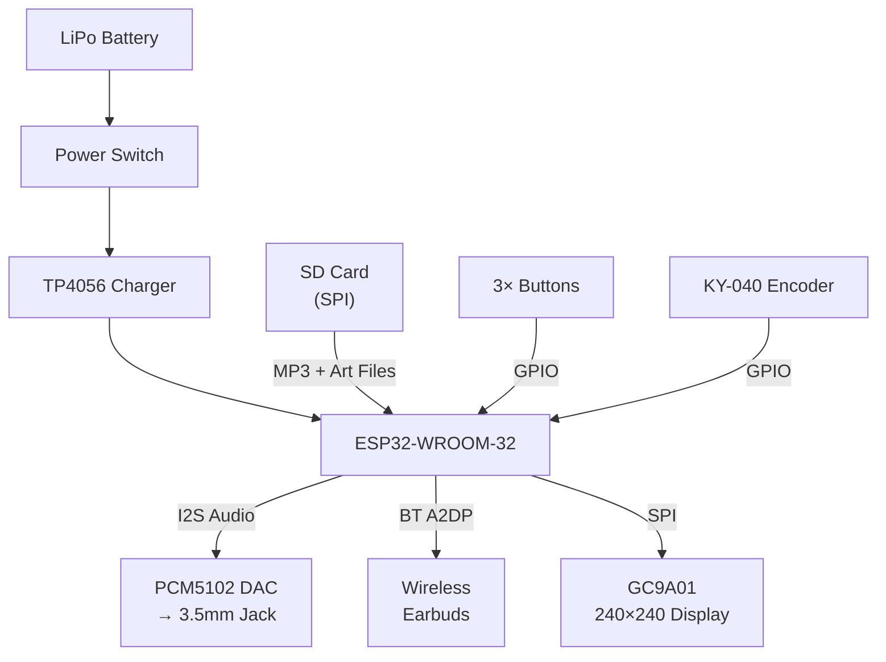
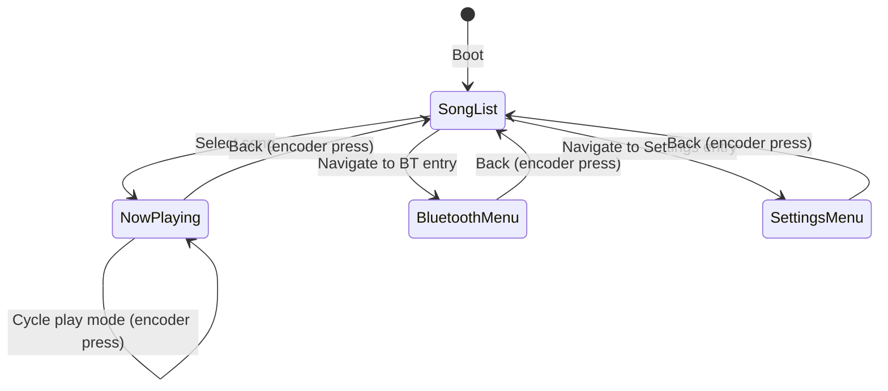

# Product Requirements Document: ESP32 Portable MP3 Player

**Version:** 3.0  
**Last Updated:** 2026-07-06

> [!NOTE]
> **v3.0 board change:** Moved from ESP32-S3 to the **classic ESP32-WROOM-32**. The S3 has no Bluetooth Classic (BLE only), so the A2DP requirements (§3.4) were unimplementable on it — only the original ESP32 can act as an A2DP source. Trade-off: the WROOM-32 has **no PSRAM**, which drives the memory budget in §4.

---

## 1. Product Overview

A battery-powered, handheld MP3 player built around the **ESP32-WROOM-32**. The device reads MP3 files from an SD card, displays a UI on a circular screen, and primarily streams audio wirelessly via **Bluetooth A2DP** to earbuds/speakers, with a secondary wired output option via the PCM5102 DAC. A signature visual feature is a **vinyl-style spinning album art** animation during playback.

### Development Phases

| Phase | Description |
|---|---|
| **Phase 1 — Prototyping** | Test all modules on an ESP32-WROOM-32 dev board with breadboard wiring |
| **Phase 2 — Firmware** | Develop and stabilize firmware on the dev board |
| **Phase 3 — PCB Design** | Design a custom PCB integrating all components |
| **Phase 4 — Enclosure** | 3D print an enclosure for the final assembly |

---

## 2. Hardware Bill of Materials

| Component | Model | Interface | Key Specs |
|---|---|---|---|
| MCU | ESP32-WROOM-32 | — | Dual-core LX6 @ 240 MHz, **4 MB Flash, no PSRAM**, 520 KB SRAM, **BT Classic (A2DP!)** + BLE + WiFi |
| DAC | PCM5102 | I2S | 32-bit, up to 384 kHz, 112 dB SNR, 3.5 mm jack (secondary output) |
| Display | GC9A01 1.28" Round | SPI | 240×240 px, IPS TFT, 65K color, 3.3V |
| Storage | SPI SD Card Reader | SPI | FAT32, stores MP3 files + pre-scaled album art |
| Input — Dial | KY-040 Rotary Encoder | GPIO (2 data + 1 button) | Quadrature output, integrated push-button |
| Input — Buttons | 3× Tactile Buttons | GPIO | Select/Play, Next, Previous |
| Battery | 3.7V LiPo Cell | — | Capacity TBD based on enclosure size |
| Charger | TP4056 Module | — | 1A USB-C LiPo charging with protection |
| Power Control | SPDT Slide Switch | — | Hard power-off between battery and system |

> [!IMPORTANT]
> **SPI Buses:** The GC9A01 display runs on **VSPI** and the SD card reader on **HSPI** — two independent hardware buses, so no bus-sharing mutex is needed and display refresh can't stall audio reads.

---

## 3. Functional Requirements

### 3.1 Audio Playback

| ID | Requirement | Priority |
|---|---|---|
| AUD-01 | Decode and play MP3 files (CBR and VBR, 128–320 kbps) from SD card | Must |
| AUD-02 | **Default output:** Stream decoded audio via Bluetooth A2DP (SBC codec) to paired wireless earbuds/speakers | Must |
| AUD-03 | **Secondary output:** Output decoded audio via I2S to the PCM5102 DAC for wired 3.5 mm headphone output | Must |
| AUD-04 | User-selectable audio output mode (BT or Wired) via a **Settings menu** option. Bluetooth is default on boot | Must |
| AUD-05 | Support 44.1 kHz / 16-bit stereo as the primary audio format | Must |
| AUD-06 | Gapless playback between tracks | Should |
| AUD-07 | Resume playback from last position after power cycle | Could |

### 3.2 User Interface & Display

| ID | Requirement | Priority |
|---|---|---|
| UI-01 | **Song List Screen:** Scrollable list of songs showing title (from ID3 tag or filename). Menu entries for Bluetooth and Settings at the top | Must |
| UI-02 | **Now Playing Screen:** Song title, artist, and spinning album art. Playback mode indicator (shuffle/repeat) | Must |
| UI-03 | **Vinyl Spin Animation:** Album art rendered as a circle and continuously rotated (~33 RPM) to simulate a spinning record | Must |
| UI-04 | **Bluetooth Menu Screen:** Scan for devices, show available sinks, pair/connect/disconnect | Must |
| UI-05 | **Settings Menu Screen:** Audio output toggle (BT/Wired), and future settings | Must |
| UI-06 | **Volume Indicator:** On-screen overlay that appears when volume is adjusted via encoder | Should |
| UI-07 | **Playback Progress:** Ring around the outer edge of the display showing track progress | Should |
| UI-08 | Smooth transitions between screens (slide or fade) | Could |
| UI-09 | Display should dim/sleep after inactivity to save battery; wake on any input | Should |

### 3.3 Input Controls

| ID | Requirement | Priority |
|---|---|---|
| INP-01 | **Button 1 (Select/Play):** Short press = play/pause on Now Playing, select/enter in menus | Must |
| INP-02 | **Button 2 (Next):** Short press = next track; long press = fast-forward seek | Must |
| INP-03 | **Button 3 (Previous):** Short press = previous track (restart if >3s in); long press = rewind seek | Must |
| INP-04 | **Rotary Encoder Rotation:** Adjust volume (CW = up, CCW = down) on Now Playing; scroll list in menus | Must |
| INP-05 | **Rotary Encoder Push (Now Playing):** Cycle playback mode: Normal → Shuffle → Repeat All → Repeat One → Normal | Must |
| INP-06 | **Rotary Encoder Push (Menus):** Navigate back to previous screen | Must |
| INP-07 | All buttons should be software-debounced (≥30 ms) | Must |

### 3.4 Bluetooth

| ID | Requirement | Priority |
|---|---|---|
| BT-01 | Act as A2DP **Source** — stream audio to Bluetooth headphones/speakers | Must |
| BT-02 | Scan for nearby A2DP sink devices and display results on screen | Must |
| BT-03 | Support pairing and bonding (remember paired devices across reboots via NVS) | Must |
| BT-04 | Auto-reconnect to last paired device on boot (when BT mode is active) | Must |
| BT-05 | AVRCP support (volume sync, play/pause/next/prev remote control from earbuds) | Should |
| BT-06 | Display Bluetooth connection status icon on all screens | Should |

### 3.5 SD Card & File System

| ID | Requirement | Priority |
|---|---|---|
| SD-01 | Read FAT32-formatted SD cards (up to 32 GB) | Must |
| SD-02 | Scan for `.mp3` files recursively in all directories | Must |
| SD-03 | Parse ID3v2 tags for title, artist, album | Must |
| SD-04 | Load **pre-scaled album art** from companion `.art` or `.jpg` files placed alongside MP3s by the desktop tool (see §3.6) | Must |
| SD-05 | Fallback: if no pre-scaled art file exists, display a default/generic album art image | Must |
| SD-06 | Graceful handling of missing/corrupt tags — fall back to filename | Must |
| SD-07 | Support alphabetical and folder-based sorting | Should |
| SD-08 | Cache file list and metadata index to SD card to avoid re-scanning on every boot | Should |

### 3.6 Desktop Album Art Pre-Scaler Tool

| ID | Requirement | Priority |
|---|---|---|
| TOOL-01 | Python CLI tool that processes a directory of MP3 files | Must |
| TOOL-02 | Extract embedded album art (JPEG/PNG) from ID3v2 APIC frames | Must |
| TOOL-03 | Resize and crop to 120×120 pixels (RAM cap on the no-PSRAM WROOM-32), circular mask optional | Must |
| TOOL-04 | Convert to a firmware-friendly format: **RGB565 raw bitmap** (saves JPEG decode on device) or optimized JPEG | Must |
| TOOL-05 | Save output alongside each MP3 with matching filename (e.g., `song.mp3` → `song.art`) | Must |
| TOOL-06 | Skip files that already have an up-to-date `.art` file (based on modification time) | Should |
| TOOL-07 | Support batch processing with progress bar | Should |
| TOOL-08 | Cross-platform: Windows, macOS, Linux | Should |

---

## 4. Non-Functional Requirements

| ID | Requirement | Notes |
|---|---|---|
| NFR-01 | **Memory Budget:** No PSRAM — everything lives in 520 KB internal SRAM alongside the ~150 KB BT Classic stack. Helix MP3 decode (~30 KB), LVGL draw buffers (2×14.4 KB), album art ≤120×120 RGB565 (28.8 KB), BT PCM ring buffer (16 KB) | Critical |
| NFR-02 | **Display Frame Rate:** Vinyl spin animation at ≥20 FPS (target 30) | Smooth visual |
| NFR-03 | **Audio Latency:** ≤200 ms end-to-end (decode → BT output) | Acceptable for music |
| NFR-04 | **Boot Time:** Device ready to play within 5 seconds | User experience |
| NFR-05 | **Battery Life:** Target ≥4 hours continuous BT playback (depends on cell capacity) | Portability |
| NFR-06 | **Debounce Reliability:** No phantom button presses or encoder jitter | Input quality |

---

## 5. System Architecture



### Pin Assignment (Prototype Wiring — ESP32-WROOM-32)

| Signal | GPIO | Notes |
|---|---|---|
| **Display SCK** | GPIO 18 | VSPI, IOMUX-native → 40 MHz |
| **Display MOSI** | GPIO 23 | VSPI |
| **Display CS** | GPIO 5 | GC9A01 chip select |
| **Display DC** | GPIO 2 | Data/command (also onboard LED — harmless) |
| **Display RST** | GPIO 4 | GC9A01 reset |
| **Display BL** | GPIO 19 | Backlight |
| **SD SCK** | GPIO 14 | HSPI |
| **SD MOSI** | GPIO 13 | HSPI |
| **SD MISO** | GPIO 35 | Input-only pin — ideal for MISO |
| **SD CS** | GPIO 15 | SD reader chip select |
| **I2S BCK** | GPIO 26 | To PCM5102 BCK |
| **I2S WS (LRCK)** | GPIO 25 | To PCM5102 LCK |
| **I2S DOUT** | GPIO 22 | To PCM5102 DIN |
| **Encoder CLK** | GPIO 32 | KY-040 clock |
| **Encoder DT** | GPIO 33 | KY-040 data |
| **Encoder SW** | GPIO 27 | KY-040 push button (internal pull-up) |
| **Btn Select/Play** | GPIO 16 | Internal pull-up |
| **Btn Next** | GPIO 17 | Internal pull-up |
| **Btn Previous** | GPIO 21 | Internal pull-up |
| **Battery ADC** | GPIO 34 | **ADC1** — ADC2 is unusable while BT is on |

> [!CAUTION]
> WROOM-32 pin rules: GPIO 6–11 are flash (never use). GPIO 0 is a strapping pin. **GPIO 12 is deliberately unused** — many SD modules have pull-ups on every line, and a pull-up on GPIO 12 at boot selects 1.8 V flash voltage and bricks the boot. GPIO 34/35/36/39 are input-only with no internal pull-ups.

---

## 6. UI/UX Flow



### Screen Descriptions

1. **Song List** — Vertically scrollable list. Menu entries at top: `⚙ Settings`, `🔵 Bluetooth`. Rotary encoder scrolls, **Select/Play** button enters.
2. **Now Playing** — Circular album art spinning at ~33 RPM. Song title and artist as marquee text. Progress ring around display edge. Playback mode icon (🔀 shuffle, 🔁 repeat all, 🔂 repeat one). Volume overlay on encoder turn.
3. **Bluetooth Menu** — Sub-screens: *Scanning…*, *Device List* (paired devices first), *Connection Status*. Select to pair/connect.
4. **Settings Menu** — Audio Output: `Bluetooth (default)` / `Wired (3.5mm)`. Future: EQ, display brightness, etc.

---

## 7. Risks & Mitigations

| # | Risk | Mitigation |
|---|---|---|
| 1 | **SPI contention** — Display refresh vs. SD reads | Eliminated: display on VSPI, SD on HSPI (independent hardware buses) |
| 2 | **BT + MP3 decode CPU load** — Both are compute-heavy | Audio decode task pinned to Core 0 (with BT stack), UI/input on Core 1; BT sends from a 16 KB PCM ring buffer that absorbs jitter |
| 3 | **Album art too large for RAM** | Desktop pre-scaler outputs ≤120×120 RGB565 (28.8 KB); firmware rejects larger files (`ART_MAX_SIDE`) |
| 4 | **BT A2DP memory overhead** (~150 KB, no PSRAM) | WiFi stack never started; LVGL buffers trimmed to 30 rows; measured static RAM 18.4% at build |
| 5 | **SD card hot-removal** | Detect via card-detect pin (if available) or handle SPI errors gracefully. Pause playback on removal |
| 6 | **Non-44.1 kHz MP3s over BT** — A2DP link is fixed at 44.1 kHz | Files at other sample rates play off-speed on BT (fine on wired). Mitigate by re-encoding, or add a resampler later |

---

## 8. Desktop Album Art Pre-Scaler — Detailed Spec

### Overview
A Python CLI tool that users run on their PC **before loading MP3s onto the SD card**. It extracts embedded album art, resizes to 120×120 (default, configurable with `--size`), and saves in a device-friendly format.

### Usage
```bash
python prescale_art.py /path/to/music/folder
```

### Behavior
1. Recursively walk the input directory for `.mp3` files
2. For each MP3, extract the first `APIC` (attached picture) frame from ID3v2 tags
3. Resize/crop to 120×120 pixels (center-crop if non-square)
4. Convert to **RGB565 raw bitmap** (28,800 bytes, big-endian to match `LV_COLOR_16_SWAP`) — no JPEG decode needed on device
5. Save as `<original_filename>.art` in the same directory
6. Skip if `.art` file exists and is newer than the `.mp3`
7. Print summary: processed / skipped / failed counts

### Dependencies
- `mutagen` — MP3 ID3 tag parsing
- `Pillow` — Image processing
- Python 3.8+

---

## 9. Future Enhancements (Post-MVP)

- **OTA Firmware Updates** via WiFi
- **Battery level indicator** on display (via ADC voltage divider)
- **Equalizer presets** (bass boost, vocal, flat, etc.)
- **Playlist / Favorites** support
- **Sleep timer** — auto-pause after N minutes
- **Light-sleep** power mode when idle
